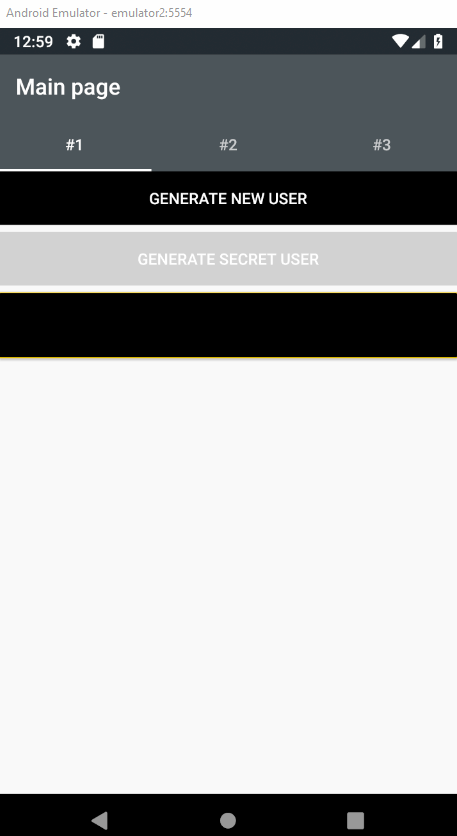
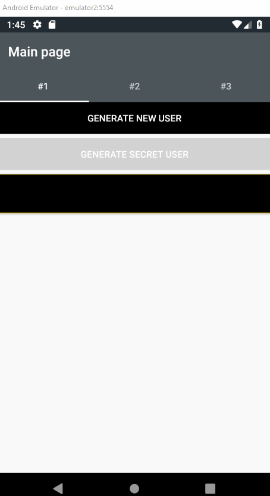

# Mvvm Cross Sharing Parameters Between Tabs

## How we Could Share Data Between Tabs in runtime?

If simple navigation parameters at MvvmCross is not enough. And we need to share some data after collecting from the database or after some user modifications. We should just add behavior for our root tabbed page. 😉

##  How we can do that?

Here we have true freedom about the way. But as the example I will show you two ways: 
1. More Generic with Interfaces
2. Strongly Typed for special solution.

### More Generic Way:

Here we will pass parameters by `IParametrizedViewModel` interface where have only one field:

```cs
public interface IParametrizedViewModel
{
    ObservableCollection<User> UserCollection { get; set; }
}
```

All our view models for tabs are implement it.

#### [Solution](MvvmCrossMoveParametersBetweenTabs.UI/Behavior/ParametrizedTabBehavior.cs):

1. Creating new class at your Xamarin.Forms project inherited from `Behavior<MvxTabbedPage>`
2. Create two local fields: one for our bindable object(`AssociatedObject`) and second for last view model(`_currentViewModel`)
3. Override `OnAttachedTo` and `OnDetachingFrom`
4. There add subscription to `CurrentPageChanged` event on `bindable`
5. Assign `bindable` into our `AssociatedObject` field.
6. At our function assigned to `CurrentPageChanged` event we should:
    1. Check if `AssociatedObject.CurrentPage` is `IMvxPage`(base interface for all MvvmCross pages)(`p`)
    2. Check if `p.ViewModel` is `IParametrizedViewModel`(view model that we need)(`newViewModel`)
    3. Assign data from`_currentViewModel` into `newViewModel`
    4. Rewrite reference of `_currentViewModel` into `newViewModel`
7. Attach new behavior at `HomePage.xaml`:
``` xml
<views:MvxTabbedPage ...>
<TabbedPage.Behaviors>
        <behavior:ParametrizedTabBehavior/>
    </TabbedPage.Behaviors>
</views:MvxTabbedPage>
```

### Strongly Typed Way:

Here we want to cover only one specific scenario - passing Secret User. 

Property `SecretUser` is only at `DetailsViewModel` and at `ThirdDetailsViewModel`, it's missed at `SecondDetailsViewModel`:

```cs
private User _secretUser;
public User SecretUser
{
    get => _secretUser;
    set => SetProperty(ref _secretUser, value);
}
```

Here we also can add one more interface and passing values only for view models that implement it. But here we want to pass that property from `DetailsViewModel` to `ThirdViewModel`, because the last one can't generate or modify it.

#### [Solution](MvvmCrossMoveParametersBetweenTabs.UI/Behavior/HomeSecretBehavior.cs):

1. Creating new class at your Xamarin.Forms project inherited from `Behavior<MvxTabbedPage<HomeViewModel>>` 
2.  Create **one** local fields for our bindable object(`AssociatedObject`) 
3. Override `OnAttachedTo` and `OnDetachingFrom`
4. There add subscription to `CurrentPageChanged` event on `bindable`
5. Assign `bindable` into our `AssociatedObject` field.
6. At our function assigned to `CurrentPageChanged` event we should:
    1. Check if `AssociatedObject.CurrentPage` is `IMvxPage`(base interface for all MvvmCross pages)(`p`)
    2. Call function `OnSelectedTabChanged` from our `HomeViewModel` and pass like an argument page view model `p.ViewModel`
7. At `HomeViewModel` inside our function `OnSelectedTabChanged` we should:
    1. Check if `_previousViewModel` is `DetailsViewModel` and `selectedViewModel` is `ThirdDetailsViewModel`. 
    2. Then just assign `SecretUser` from `DetailsViewModel` into `ThirdDetailsViewModel`
8. Attach new behavior at `HomePage.xaml`:
``` xml
<views:MvxTabbedPage ...>
<TabbedPage.Behaviors>
        <behavior:ParametrizedTabBehavior/>
        <behavior:HomeSecretBehavior/>
    </TabbedPage.Behaviors>
</views:MvxTabbedPage>
```

## Example in GIF:
<div>
    
    
</div>
